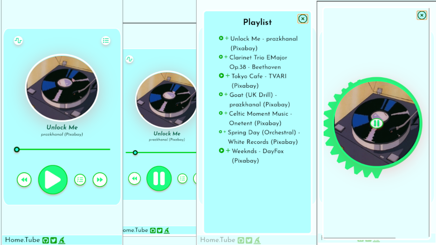

## home.tube

### WIP, v0.1.3

> a simple webapp to be hosted; when need to serve on-disk media on private network

#### Done.

* **v0.1.3**: Standard circular spike visualization linked to Audio signals.
* **v0.1.2**: Have Playlist & Queued lists; with moving entries to each other.. playing either as a set.
* **v0.1.1**: Media Widget loading an audio.json and playing first entry.
* **v0.1.0**: Simple Media Widget playing a provided audio.

[demo](https://abhishekkr.github.io/home.tube/)

---
